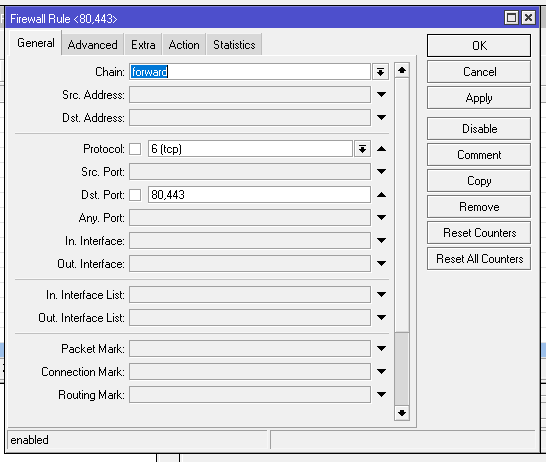
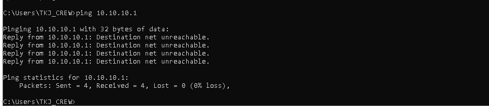

# LAB-46-FIREWALL
TANGGAL 25 agustus 2025

# firewall 
Firewall adalah sistem keamanan yang berfungsi untuk memonitor dan mengontrol lalu lintas data yang masuk dan keluar dari jaringan atau perangkat. Secara sederhana, firewall bisa kamu anggap seperti pagar atau tembok yang memisahkan perangkat kamu dengan dunia luar, menghalangi akses yang tidak sah atau berbahaya. Di dunia digital yang penuh dengan ancaman, firewall sangat penting untuk mencegah serangan dari pihak yang tidak bertanggung jawab. Misalnya, hacker yang berusaha masuk ke perangkat kamu untuk mencuri informasi pribadi atau menyebarkan malware. Dengan menggunakan firewall, kamu dapat memblokir atau memperbolehkan akses berdasarkan aturan yang sudah ditetapkan, sehingga memberikan perlindungan ekstra.

# firewall filter rules
**pengertian chain di filter rule:**        
*1. input*      
     di gunakan untuk mengelola paket yang masuk menuju router melalui salah satu interface router dan alamat ip yang di miliki router. jenis traffic rule ini bisa berasal dari jaringan public ataupun jaringan local.      
*2. forward*   
     di gunakan untuk mengelola paket yang masuk ke router dan kemudian diteruskan ke tujuan dengan cara melewati router     
*3. output*    
     di gunakan untuk mengelola traffic yang keluar dari router ke alamat tujuan. Jadi traffic berasal dari dalam router ke destination network. 

**pengertian action di firewall di filter rule:**

*1. accept*  
   Menerima paket dan melanjutkan proses routing atau forwarding.

*2. add dst to address list*  
   Menambahkan alamat IP sumber ke address list. Digunakan untuk tracking/otomatisasi.

*3. add src to address list*  
   Menambahkan alamat IP tujuan paket ke address-list tertentu.

*4. drop*  
   Menolak/membuang paket tanpa pemberitahuan ke pengirim.

*5. fasttrack connection*  
   Mengaktifkan FastTrack untuk mempercepat pemrosesan koneksi. Paket-paket dari koneksi tersebut diproses lebih efisien.

*6. jump*  
   Melompat ke user-defined custom chain sesuai dengan parameter jump-target

*7. log*  
   Mencatat informasi paket ke log Mikrotik (untuk analisis/troubleshooting).

*8. passtrough*  
   Melanjutkan evaluasi ke rule berikutnya, tanpa menghentikan pemrosesan.

*9. reject*   
   Menolak paket dengan memberikan pesan error ke pengirim.

*10. return*    
    Kembali ke chain sebelumnya (berguna ketika menggunakan jump).

*11. tarpit*    
    Tahan koneksi TCP dan balas SYN/ACK.

# konfigurasi simpel
**contoh:**

1. kita akan membuat router tidak bisa di akses melalui http (web interface).     
   pilih menu ip > firewall > filter rules.

   Menolak (**drop**) semua koneksi/paket dengan protocol TCP ke port 80 (HTTP) Yang datang melalui interface ether2.

2. lalu kita akan membuat Router tidak memproses ping yang berasal dari interface ether2 dan hanya mengirimkan pesa/pemberitahuan.     
    pilih menu ip > firewall > filter rules.

   Menolak (**reject**)  semua paket ICMP (misalnya: ping) Yang datang ke router melalui interface ether2 Dengan memberi tahu pengirim bahwa permintaan ditolak (berbeda dari drop yang diam-diam).

3. action **log** Mencatat semua trafik ICMP (ping) yang masuk ke router lewat ether2 Tapi tidak menghentikan atau memproses paketnya secara langsung Mikrotik akan melanjutkan pemrosesan ke rule selanjutnya. berikut cara konfig dan cek nya:

    pilih menu ip > firewaal > filter rules

   untuk melihat semua catatan yang masuk ke router bisa pilih di menu **log** 

4. kita akan membuat pengaksesan mikrotik via SSH bisa terihat di proses padalah tidak menggunakan action **tarpit**.

login ssh via putty

   Siapa pun yang mencoba akses SSH ke router Mikrotik akan dijebak Mereka tidak akan bisa login, tapi juga tidak langsung ditolak Sesi koneksi akan menggantung, menguras sumber daya penyerang 22 dalah port dari ssh dan ssh juga masuk ke protocol tcp.

5. **add-dst-to-address-list**
   IP tujuan paket yang match akan dimasukan ke address list. Biasanya dipakai untuk tracking koneksi luar,   
   Contoh Penggunaan:   
   Contoh kita mau mencatat IP tujuan yang diakses klien.

6. **jump**    
   kita akan membuat dimana chain bisa melompat ke chain tertentu dengan chain custom  

7. **return**
   Kembali ke chain asal lebih awal, tidak menunggu sampai akhir custom chain. Setelah return, paket balik ke chain input, lalu diterusin baca rule berikutnya setelah jump.

8. **passthrough**  
   Jika rule tidak match, paket langsung berhenti di rule itu.

9. accept
   disini saya akan mengizinkan ping yang berasal dari ether2 ke mikrotik

